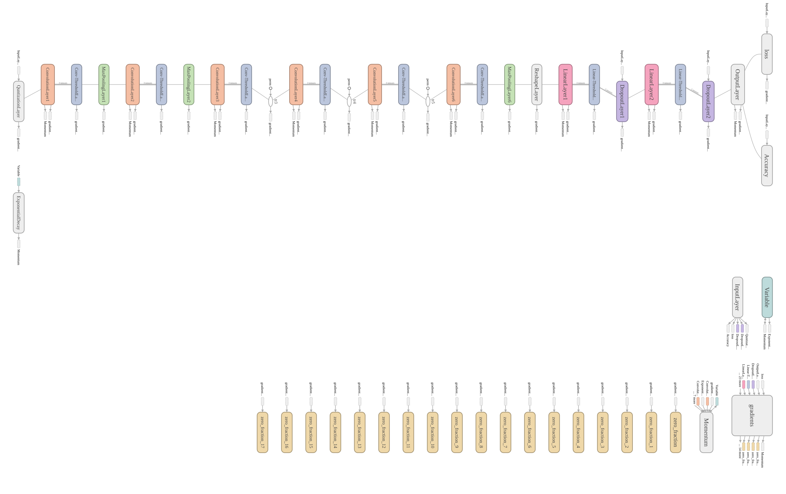
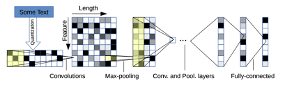

# CharCNN

I use TensorFlow framework to create CharCNN model to detect sarcasm in English text. You can detect other characteristics when you provide data in data folder. 

The architecture was created by [Character-level Convolutional Networks for Text Classification](https://proceedings.neurips.cc/paper/2015/file/250cf8b51c773f3f8dc8b4be867a9a02-Paper.pdf).

---

## Overview

### Dataset
I use dataset supplied by google api. You can find it at [here](https://storage.googleapis.com/download.tensorflow.org/data/sarcasm.json).

### Model Architecture






The model utilizes Convolution 1D to extract features of the text, after that go throguh fully connected layers to classify.

### Training

Small CharCNN and Large CharCNN take me only 5 epochs to get nearly 85% accuracy, but it will take a lot of time to train for Large CharCNN due to high number of parameters.

---
## How to use my code

### 1. Clone it and install requirements libraries

```
git clone https://github.com/hoangcaobao/CharCNN.git
cd CharCNN
pip install -r requirements.txt
```

### 2. Upload data to train
Go to folder data, put data in json file in it. I already put sacarsm data in this folder.

### 3. Train model
This step makes you wait very long but it is required to get weights of model before next step.
```
python3 train.py --data-path ${} --epochs ${}
```
For example:
```
python3 train.py --data-path data/sarcasm.json --epochs 5
```

### 4. Put sentences you want CharCNN to detect in test folder

### 5. Use model
```
python3 predict.py --data-path ${} --test-path ${} --num-classes ${}
```
For exmaple:
```
python3 predict.py --data-path data/sarcasm.json --test-path test/sentences.json --num-classes 2
```
### Now you will have output of test folder in result.json file in result folder

### Thank you for reading

---
## HOANG CAO BAO


